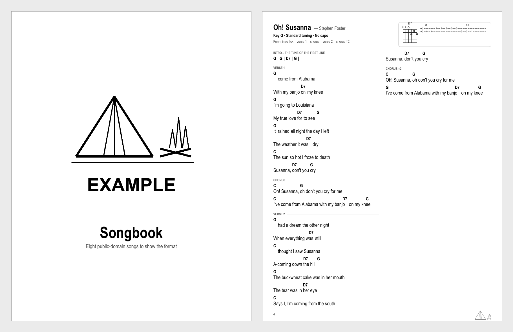

# Songbook

Turn a folder of chord charts into a printable songbook: one song per page, chords
above the lyrics in two columns, chord diagrams and a lick of tab in the corner, a
cover, a table of contents by category, page numbers, and a back page. Made for
singalongs where the pages have to be readable by firelight.

You bring the songs. The tool brings the layout: copy the example book, replace its
charts with your own, and build.

## What you get

[**Example songbook (PDF)**](books/example/songbook.pdf) is the book built from
`books/example`: eight public-domain songs with a cover, a contents page by category,
chord diagrams and a lick of tab in each header, page numbers and a back page. Open it
to see exactly what your own charts will turn into.

[](books/example/songbook.pdf)

## Quick start

```
python3 -m venv .venv
.venv/bin/pip install -r requirements.txt
.venv/bin/python build.py books/example
open build/example/songbook.pdf
```

`build.py` prints one line per song with its page number and lyric size, and fails if
a song did not fit on its page.

## Make your own book

The example songs are placeholders. A real book is the same format filled with your
own charts:

1. Copy `books/example` to `books/<your-name>`.
2. Edit `book.toml`:

   ```toml
   title = "Our Songbook"
   cover_word = "Songbook"          # printed under the logo on the cover
   subtitle = "Songs for the porch"
   logo = "assets/logo.png"         # PNG with transparency; delete the line for a text cover
   footer_mark = "auto"             # small logo in each page's footer: "auto", "none", or a path
   groups = ["Singalongs", "Ballads"]   # order of the contents sections
   ```

3. Replace `assets/logo.png` with your own artwork, or remove the `logo` line.
4. Replace the charts in `songs/` with yours (format below), one file per song.
5. Put `books/<your-name>` in `BOOK.md` so `build.py` with no arguments builds it.
6. Run `.venv/bin/python build.py`.

The example book's songs are all public domain. The charts you add are yours to
license; this repository's MIT licence covers the tool.

## Chart format

A plain text file, chords on the line above the words they fall on:

```
# title: Oh! Susanna
# artist: Stephen Foster
# key: G
# capo: No capo
# group: Singalongs
# structure: verse 1 – chorus – verse 2 – chorus – verse 3 – chorus

@diagram D7 xx0212

[Verse 1]
G                          D7
I come from Alabama with a banjo on my knee
G                                  D7          G
I'm going to Louisiana, my true love for to see

[Chorus]
C            G              D7
Oh! Susanna, oh don't you cry for me
```

- `# key:`, `# tuning:` and `# capo:` print on the guide line under the title.
- `# group:` puts the song under that heading in the contents. Groups appear in the
  order listed in `book.toml`; anything else goes last under "Other".
- `[Section]` headings print as small labels. `[Chorus ×2]` and cues like
  `[Verse 3 – as verse 1]` are just text.
- A line whose every token is a chord is a chord line. If no lyric follows it, it prints
  on its own, which is how you write intros and instrumentals:
  `G   |   C   |   D7   |   G   |   (x2)`.
- `@diagram NAME frets` adds a chord box to the header. Frets run low string to high,
  `x` mutes and `0` is open: `@diagram D7 xx0212`.
- `@tab` starts a tab block for the header box and ends at a blank line. Include only
  the strings the lick uses.
- Chords align by column, so use spaces, not tabs, and keep chord names above the
  syllable they land on.

Per-song switches, all off by default:

| Line | Effect |
| --- | --- |
| `# landscape: yes` | landscape page, wider columns |
| `# spread: yes` | two facing pages; a blank is inserted so it opens flat |
| `# chorus-markers: yes` | every chorus after the first prints as a one-line "as before" cue |
| `# min-size: 12` | stop shrinking the lyrics at this size and warn instead |

## How pages are laid out

The lyric size starts at 13pt and shrinks until the song fits one page, down to 9.5pt.
A song that lands small can usually be rescued with chorus markers, a landscape page,
or by merging short lines in pairs in the chart. Spreads are placed so they open on a
left-hand page, and the contents keeps alphabetical order by artist within each group
even when a spread had to move.

## Fetching charts

`fetch_ug.py search "song artist"` lists Ultimate Guitar chord versions with their vote
counts, and `fetch_ug.py get <url> out.txt` saves one as a text file you can convert
into the format above. It is for personal use; the lyrics remain the songwriters'.

## Tests

```
.venv/bin/python -m pytest -q
```
